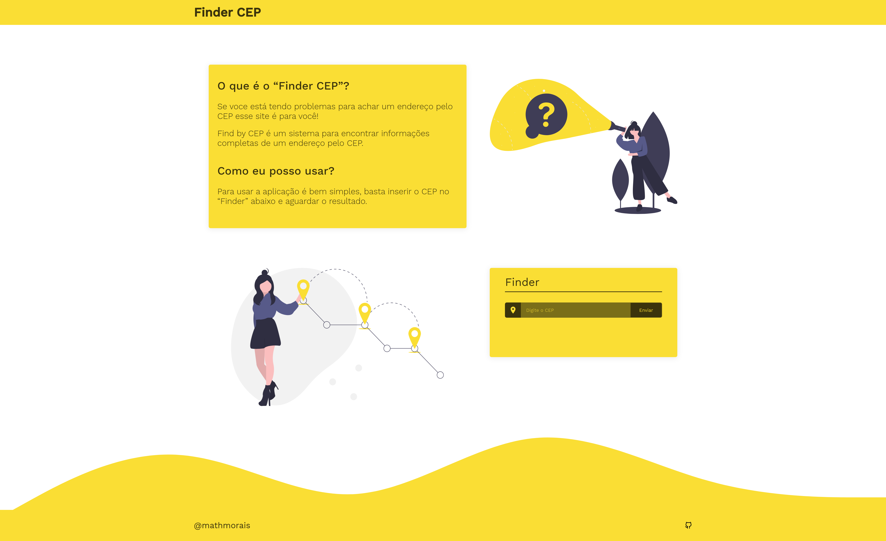

<h1 align="center">Finder by CEP</h1>

<div align="center">


</div>

## 📝 Tabela de Conteudos

- [Overview](#overview)
  - [Tecnologias Usadas](#tecnologias-usadas)
- [Sobre](#sobre)
- [Como ultilizar](#como-iniciar)
- [Contato](#contato)

## Overview



### Sobre

O Projeto tem como finalidade, ajudar pessoas a encotrarem de forma mais facil endereços pelo CEP

Para usar a aplicação é bem facil, basta passar o cep no campo indicado e a API ira retornara endereço, bairro, DDD e etc, com base no CEP que o usuário enviou.

Eu realizei esse projeto enquanto estava estudando NextJs, ultilizando o figma para fazer o layout.

Aprendi bastante com esse projeto, principalmente na hora do design que eu estou bem noob ainda 😄.

### Tecnologias usadas

- [NextJS](https://nextjs.org/)
- [NodeJS](https://nodejs.org/en/)
- [Express](https://expressjs.com/)
- [LootieFiles](https://lottiefiles.com/)

#### API

- [ViaCEP](https://viacep.com.br/)

## Como iniciar

Para clonar e iniciar essa aplicação, você vai precisar do [Git](https://git-scm.com) e do [Node.js](https://nodejs.org/en/download/) instalado no seu computador. Após isso você pode rodar esses comandos:

```bash
# Clone esse repositorio
$ git clone https://github.com/mathmorais/Finder-CEP

# Instale as dependencias
$ npm install

# Inicie a aplicação, inicie esse comando na pasta raiz do seu projeto
$ npm run app

# Pronto! , o servidor agora estará rodando na url localhost:3000
```

## Contribuir

Se achar algum problema ou tiver alguma sugestão, basta enviar uma issue.

Mas se quiser ir mais alem e adicionar suas proprias novas funcionalidades, apenas envie um pull request com as suas modificações!

## Contato

- GitHub [@mathmorais](https://github.com/mathmorais})
